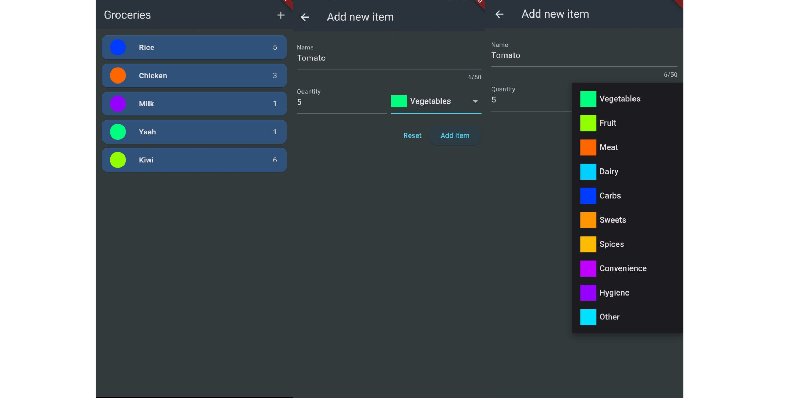

# Expense Tracker App

**Description:**

Welcome to the Expense Tracker App – your financial companion for keeping tabs on your expenses effortlessly. This app empowers you to monitor your spending habits and visualize your financial data with intuitive charts. Track expenses in various categories and gain insights into your financial patterns.

**Features:**

- **Expense Tracking:** Log your daily expenses with ease, categorizing each transaction.

- **Category-wise Spending:** Gain insights into your spending habits with a detailed breakdown of expenses by category.

- **Chart Visualization:** View a graphical representation of your expenditures through interactive charts.

- **Expense History:** Access a comprehensive history of your past expenses, helping you analyze and plan your budget.

**Screenshot:**

